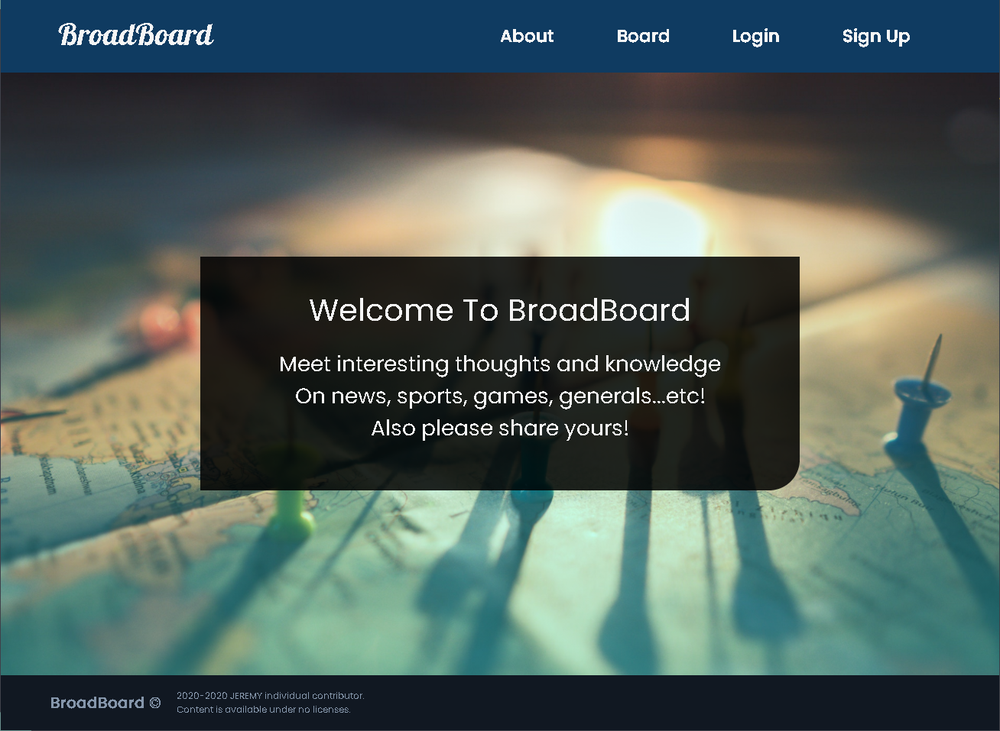

    <a href="https://github.com/jeremyoo/Broadboard_v1">
        <h1>BroadBoard</h1>
    </a>

BroadBoard is a RESTful community board. 
It is ongoing project, therefore expect more for the future!

[[Go to BroadBoard_v1]](https://broadboardv1.herokuapp.com/)

## Features
- Provide basic sign-up & sign-in authentication through passport
- Provide CRUD (create, read, update, delete) on post and comment:
    - Only successfully authenticated users are allowed to create, update and delete their posts
    - Everyone can still read the posts without authentication 
  
    
## Issue
Please submit any issue through following link [[BroadBoard_v1 Issue]](https://github.com/jeremyoo/Broadboard_v1/issues).

## License
MIT
